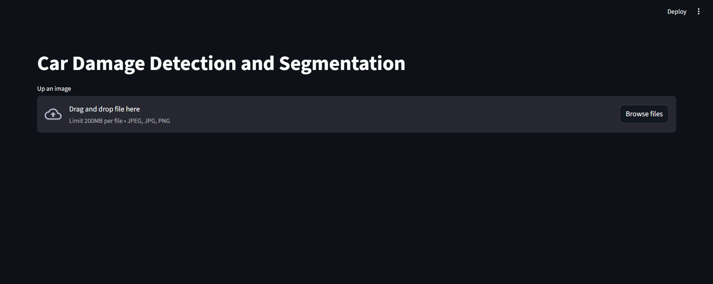
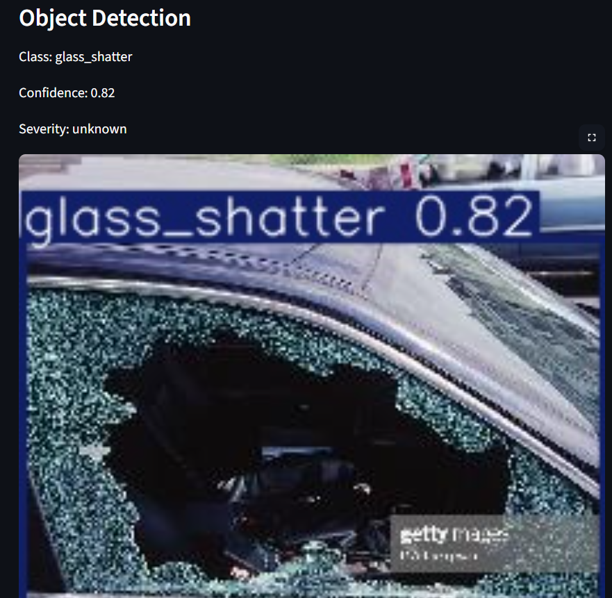
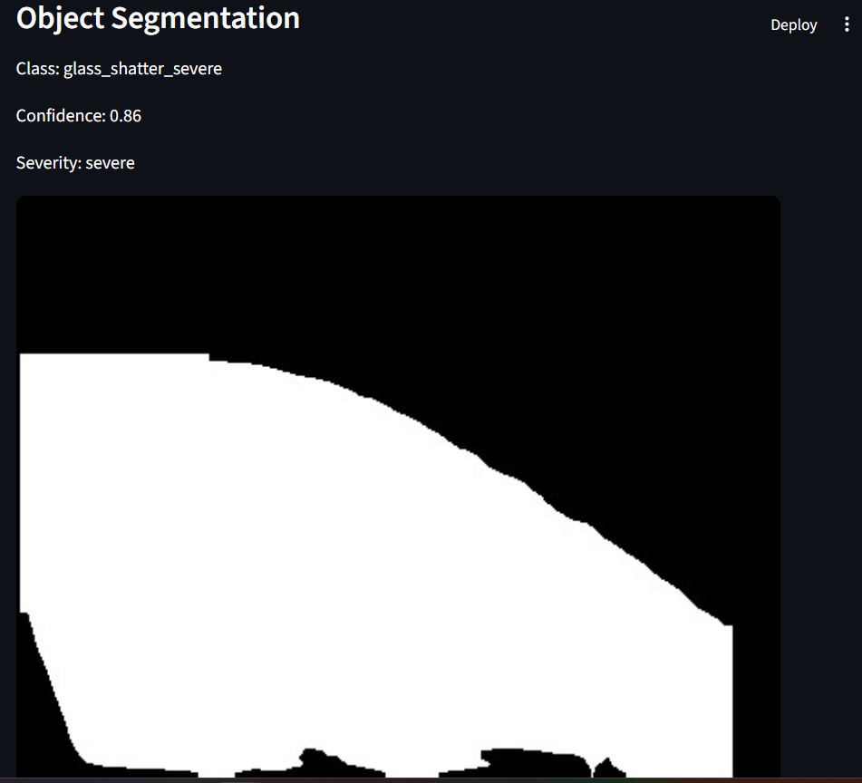

# Car Damage Assessment

## Author
- Name: Nguyen Tuan Ngoc
- University: Danang University of Science and Technology (DUT)
- Student ID: 102230087

## Project Overview
This project provides an end-to-end solution for Sun* Insurance Company for car damage assessment using deep learning. It includes:
- Damage classification (ResNet18)
- Object detection and segmentation (YOLOv8)
- Severity estimation 
- Web demo (Streamlit)

## Main Features
- Classify car damage types from images
- Detect and segment damaged car parts
- Estimate severity of damage
- REST API and Streamlit web demo

## Technology Stack
- **Backend**: Python, PyTorch, FastAPI, OpenCV, Ultralytics YOLO, Pandas, Matplotlib, TQDM
- **Frontend**: Streamlit
- **Other**: scikit-learn, PIL, seaborn

## Folder Structure
- `app/`: Backend API, model loading, prediction, detection, segmentation
- `car_damage_yolo/`, `car_segmentation/`: YOLO datasets for detection/segmentation
- `data_split/`: Preprocessed and split images for training/validation/testing, including "unknown" labels images and clean images for object detection and segmentation
- `models/`: Model weights (see below for download)
- `notebooks/`: Jupyter notebooks for training, evaluation, and data exploration
- `scripts/`: Training, evaluation, prediction, and utility scripts
- `static/`: Output images and segmentation masks
- `streamlit_app.py`: Streamlit web demo

## Model Weights
Model weights are not included in the repository. Download them from Google Drive:
- [car_resnet18_model_best.pth](https://drive.google.com/drive/u/0/folders/1BZrsCd0w1LLyp7skGPFr9yNJtmrVdNJ5)
- [yolov8n-seg.pt](https://drive.google.com/drive/u/0/folders/1BZrsCd0w1LLyp7skGPFr9yNJtmrVdNJ5)
- [yolov8s.pt](https://drive.google.com/drive/u/0/folders/1BZrsCd0w1LLyp7skGPFr9yNJtmrVdNJ5)

## Quick Start
1. Install dependencies:
   ```bash
   pip install -r requirements.txt
   ```
2. Download model weights from Google Drive and place them in the `models/` folder.
3. Run the Streamlit app:
   ```bash
   streamlit run streamlit_app.py
   ```
4. Or run training/evaluation scripts in `scripts/`.

## Demo
Below are some demo screenshots of the application in action:

### 1. Streamlit Web UI


### 2. Object Detection Result


### 3. Segmentation & Severity Estimation


## License
This project is for educational purposes only.
